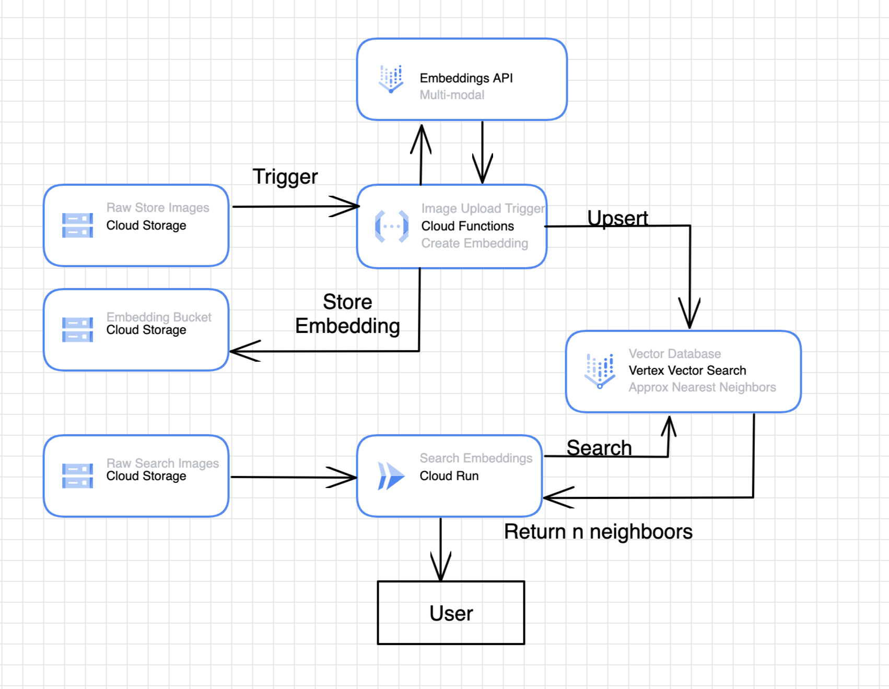

# Reverse Image Search 
Author: lukasgeiger@google.com

TLDR: Search for similar images using an image file. This tutorial uses GCP's Multimodal Embedding API 
and Vector Search to perform Approximate Nearest Neighbors (ANN) search. 

For demonstration purposes only. 

Built off of sample code provided here: https://github.com/GoogleCloudPlatform/matching-engine-tutorial-for-image-search

## Architecture Diagram 



## Steps: 
1. Build GCS buckets for images and embeddings 
2. Set up Service Accounts and grant permissions
3. Create Vector Search Index and Endpoints
4. Configure variables of createAndUpsertEmbeddings
5. Build createAndUpsertEmbeddings Cloud Function 
6. Build searchVectorDB Cloud Run 
7. Test system 

## Before you Begin 
Make sure to set your environment variables: 
```
PROJECT_NAME=<project-name>
REGION=<region> 

RAW_IMAGE_UPLOAD_BUCKET=<raw-image-upload-bucket>
EMBEDDINGS_BUCKET=<embeddings-bucket>
RAW_IMAGE_SEARCH_BUCKET=<raw-image-search-bucket>

INDEX_DISPLAY_NAME=<vector-search-index-display-name>
ENDPOINT_DISPLAY_NAME=<vector-search-endpoint-display-name>
DEPLOYED_ENDPOINT_DISPLAY_NAME=<vector-search-deployed-endpoint-display-name>
```

Data can be found in the reverse-image-search/images directory and should consist of four images: a picture of a rose, tulip, daisy, and frangipani. 

## 1 - Build GCS buckets for image_uploads, embeddings, and image_search
```
gsutil mk gs://$RAW_IMAGE_UPLOAD_BUCKET #prove-identityai-flowers-datasource
gsutil mk gs://$EMBEDDINGS_BUCKET #prove-identityai-flower-embeddings
gsuitl mk gs://$RAW_IMAGE_SEARCH_BUCKET #prove-identityai-flowers I might not need this
```


## 2 - Set up Service Accounts and grant permissions
Create two service accounts. 
One to allow permissions for the Cloud Function to read Cloud Storage, call embeddings api, and upsert to Vector Search.  
The second to allow permissions for the Cloud Run to read Cloud Storage, call embeddings api, and search Vector Search. 

```
gcloud iam service-accounts create cf_create_and_upsert \
    --display-name="Cloud Function Create and Upsert"
```
```
gcloud projects add-iam-policy-binding $PROJECT_NAME \
    --member="serviceAccount:cf_create_and_upsert@$PROJECT_NAME.iam.gserviceaccount.com" \
    --role="roles/aiplatform.serviceAgent"
gcloud projects add-iam-policy-binding $PROJECT_NAME \
    --member="serviceAccount:cf_create_and_upsert@$PROJECT_NAME.iam.gserviceaccount.com" \
    --role="roles/storage.admin"
```

```
gcloud iam service-accounts create sa-search-vector-db \
    --display-name="Cloud Run Search Neighbors"
```
```
gcloud projects add-iam-policy-binding $PROJECT_NAME \
    --member="serviceAccount:sa-search-vector-db@$PROJECT_NAME.iam.gserviceaccount.com" \
    --role="roles/aiplatform.serviceAgent"
gcloud projects add-iam-policy-binding $PROJECT_NAME \
    --member="serviceAccount:sa-search-vector-db@$PROJECT_NAME.iam.gserviceaccount.com" \
    --role="roles/run.serviceAgent"
gcloud projects add-iam-policy-binding $PROJECT_NAME \
    --member="serviceAccount:sa-search-vector-db@$PROJECT_NAME.iam.gserviceaccount.com" \
    --role="roles/storage.admin" 
gcloud projects add-iam-policy-binding $PROJECT_NAME \
    --member="serviceAccount:sa-search-vector-db@$PROJECT_NAME.iam.gserviceaccount.com" \
    --role="roles/aiplatform.user"
```


## 3 - Create Vector Search Index and Endpoints

Create Vector Search Index: Currently, you cannot create an index on 0 embeddings. You must start with at least one. This will change in the future. We will create an Stream Index to allow for near real time consistency of our vector database. 
```
curl -X POST -H "Content-Type: application/json" \
-H "Authorization: Bearer `gcloud auth print-access-token`" \
https://${REGION}-aiplatform.googleapis.com/v1/projects/${PROJECT_NAME}/locations/${REGION}/indexes \
-d '{
    displayName: "'${INDEX_DISPLAY_NAME}'",
    description: "'${INDEX_DISPLAY_NAME}'",
    metadata: {
       contentsDeltaUri: "'${EMBEDDINGS_BUCKET}'",
       config: {
          dimensions: "'1408'",
          approximateNeighborsCount: 100,
          distanceMeasureType: "DOT_PRODUCT_DISTANCE",
          algorithmConfig: {treeAhConfig: {leafNodeEmbeddingCount: 10000, leafNodesToSearchPercent: 2}}
       },
    },
    indexUpdateMethod: "STREAM_UPDATE"
}'
```

Create Endpoint: 
```
gcloud ai index-endpoints create \
--display-name=$ENDPOINT_DISPLAY_NAME \
--public-endpoint-enabled=TRUE \
--project=$PROJECT_NAME \
--region=$REGION
```

Find the id of your endpoint and the id of your index you created in previous steps. Set them as variables below.
```
ENDPOINT_ID=<endpoint-id>
INDEX_ID=<index-id>
```

Deploy to Endpoint: 
```
gcloud ai index-endpoints deploy-index $ENDPOINT_ID \
  --index=$INDEX_ID \
  --deployed-index-id=$INDEX_ID \
  --display-name=$DEPLOYED_ENDPOINT_DISPLAY_NAME \
  --project=$PROJECT_NAME \
  --region=$REGION
```

## 4 - Configure variables of createAndUpsertEmbeddings and searchVectorDB

In the createAndUpsertEmbeddings code you must update the PROJECT_NAME, REGION, and INDEX_ID variables. 

You must also update the variables in searchVectorDB. 

<!-- TODO - Take screenshots to clarify where to find each variable. -->

## 5 - Build createAndUpsertEmbeddings Cloud Function 
```
cd ~/reverse-image-search/createAndUpsertEmbeddings

gcloud functions deploy createEmbeddingandUploadGCS --gen2 --runtime=python311 --region=$REGION --source=. --entry-point=main --trigger-event-filters="type=google.cloud.storage.object.v1.finalized" --trigger-event-filters="bucket=$RAW_IMAGE_UPLOAD_BUCKET" --service-account=cf_create_and_upsert@$PROJECT_NAME.iam.gserviceaccount.com
```


## 6 - Build searchVectorDB Cloud Run 
```
cd ~/reverse-image-search/searchVectorDB

gcloud builds submit --region=$REGION --tag us-central1-docker.pkg.dev/$PROJECT_NAME/reverse-image-search/search-vector-db:v0.0 .

gcloud run deploy search-vector-db --image us-central1-docker.pkg.dev/$PROJECT_NAME/reverse-image-search/search-vector-db:v0.0 --service-account sa-search-vector-db@$PROJECT_NAME.iam.gserviceaccount.com
```

## 7 - Test system 
Test Cloud Function Upsert 
```
curl -X POST <cloud-functions-endpoint> -H "Content-Type: application/cloudevents+json"    -d '{
"specversion" : "1.0",
"type" : "example.com.cloud.event",
"source" : "https://example.com/cloudevents/pull",
"subject" : "123",
"id" : "A234-1234-1234",
"time" : "2018-04-05T17:31:00Z",
"data" : {"input_bucket": "${RAW_IMAGE_UPLOAD_BUCKET}", 
            "output_bucket":"${EMBEDDINGS_BUCKET}",
            "name": "tulip.jpg"}
}'
```

Test Cloud Run Search 
```
curl -X POST <cloud-run-endpoint> -H "Authorization: Bearer $(gcloud auth print-identity-token)" -H "Content-Type: application/json" -d '{
    "bucket":"${RAW_IMAGE_UPLOAD_BUCKET}",
    "object":"rose.jpeg"
    }'
```

Replace endpoint url with localhost:8080 if testing in a local environment.