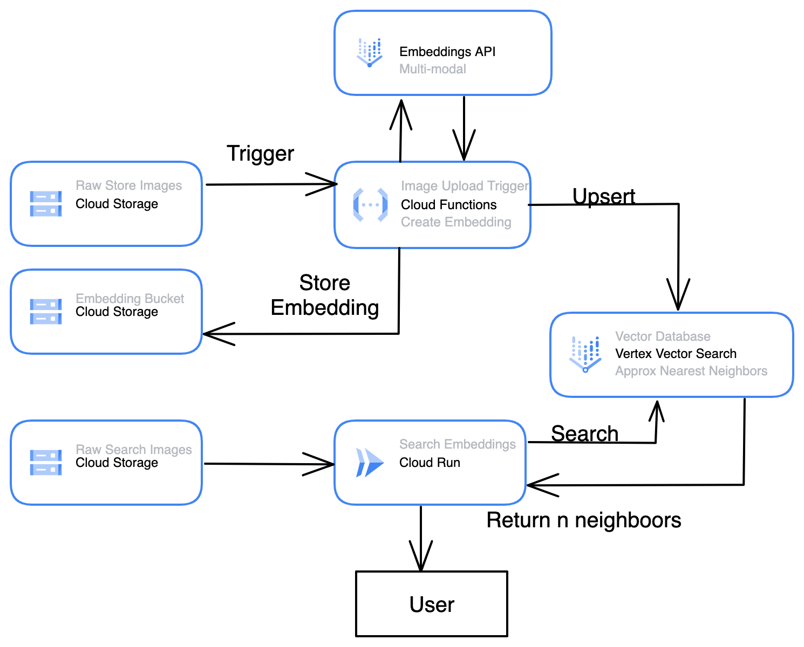

# Reverse Image Search 
Author: lukasgeiger@google.com

TLDR: Search for similar images using an image file. This tutorial uses GCP's Multimodal Embedding API 
and Vector Search to perform Approximate Nearest Neighbors (ANN) search. 

Built off of sample code provided here: https://github.com/GoogleCloudPlatform/matching-engine-tutorial-for-image-search

## Architecture Diagram 



## Steps: 
1. Build GCS buckets for images and embeddings 
2. Set up Service Accounts and grant permissions
3. Create Vector Search Index and Endpoints
4. Configure variables of createAndUpsertEmbeddings
5. Build createAndUpsertEmbeddings Cloud Function 
6. Build searchVectorDB Cloud Run 
7. Test system 

## 1 - Build GCS buckets for images and embeddings 
```
gsutil mk gs://<raw-image-bucket>
gsuitl mk gs://<embeddings-bucket>
```
Take note of the bucket names, we will use these later in the build. 

## 2 - Set up Service Accounts and grant permissions
Create two service accounts. 
One to allow permissions for the Cloud Function to read Cloud Storage, call embeddings api, and upsert to Vector Search.  
The second to allow permissions for the Cloud Run to read Cloud Storage, call embeddings api, and search Vector Search. 

```
gcloud iam service-accounts create cf_create_and_upsert \
    --display-name="Cloud Function Create and Upsert"
```
```
gcloud projects add-iam-policy-binding PROJECT_ID \
    --member="serviceAccount:SA_NAME@PROJECT_ID.iam.gserviceaccount.com" \
    --role="ROLE_NAME"
```

```
gcloud iam service-accounts create cr_search_neighbors \
    --display-name="Cloud Run Search Neighbors"
```
```
gcloud projects add-iam-policy-binding PROJECT_ID \
    --member="serviceAccount:SA_NAME@PROJECT_ID.iam.gserviceaccount.com" \
    --role="ROLE_NAME"
```

## 3 - Create Vector Search Index and Endpoints

Create Vector Search Index: Currently, you cannot create an index on 0 embeddings. You must start with at least one. This will change in the future. We will create an Stream Index to allow for near real time consistency of our vector database. 
```
curl -X POST -H "Content-Type: application/json" \
-H "Authorization: Bearer `gcloud auth print-access-token`" \
https://{REGION}-aiplatform.googleapis.com/v1/projects/${PROJECT_ID}/locations/${REGION}/indexes \
-d '{
    displayName: "'${DISPLAY_NAME}'",
    description: "'${DISPLAY_NAME}'",
    metadata: {
       contentsDeltaUri: "'${embeddings-bucket}'",
       config: {
          dimensions: "'1408'",
          approximateNeighborsCount: 100,
          distanceMeasureType: "DOT_PRODUCT_DISTANCE",
          algorithmConfig: {treeAhConfig: {leafNodeEmbeddingCount: 10000, leafNodesToSearchPercent: 2}}
       },
    },
    indexUpdateMethod: "STREAM_UPDATE"
}'
```

Create Endpoint: 
```
gcloud ai index-endpoints create \
--display-name= DEPLOYED_INDEX_NAME \
--public-endpoint-enabled \ TRUE
--project= PROJECT_ID \
--region= LOCATION
```

Deploy to Endpoint: 
```
gcloud ai index-endpoints deploy-index INDEX_ENDPOINT_ID \
  --deployed-index-id=DEPLOYED_INDEX_ID \
  --display-name=DEPLOYED_INDEX_NAME \
  --index=INDEX_ID \
  --project=PROJECT_ID \
  --region=LOCATION
```

## 4 - Configure variables of createAndUpsertEmbeddings

In the Cloud Function code you must update the upsertDatapoints endpoint with your own endpoint. Replace https://<location>-aiplatform.googleapis.com/v1/projects/<project-name>/locations/<location>/indexes/<index_id>:upsertDatapoints with your own variables. 

Also update prove-identityai-flower-embeddings with your own embedding-bucket created in step 1. 

## 5 - Build createAndUpsertEmbeddings Cloud Function 
```
gcloud functions deploy createEmbeddingandUploadGCS --gen2 --runtime=python311 --region=us-central1 --source=. --entry-point=hello_gcs --trigger-event-filters="type=google.cloud.storage.object.v1.finalized" --trigger-event-filters="bucket=prove-identityai-flowers-datasource"
```


## 6 - Build searchVectorDB Cloud Run 
```
cd ~/reverse-image-search/createAndUpsertEmbeddings

gcloud builds submit --region=us-central1 --tag us-central1-docker.pkg.dev/prove-identityai/reverse-image-search/search-vector-db:v0.0 .

gcloud run deploy search-vector-db --image us-central1-docker.pkg.dev/prove-identityai/reverse-image-search/search-vector-db:v0.0
```

## 7 - Test system 
Test Cloud Function Upsert 
```
```


Test Cloud Run Search 
```
curl -X POST <cloud-run-endpoint> -H "Authorization: Bearer $(gcloud auth print-identity-token)" -H "Content-Type: application/json" -d '{
    "bucket":"prove-identityai-flowers-datasource",
    "object":"rose.jpeg"
    }'
```